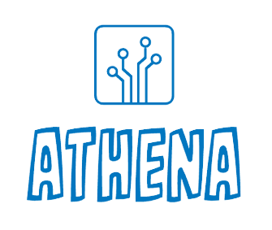

<p align="center">
    <a href="#"></a>
</p>
<p align="center">
    <a href="https://github.com/xuliangTang/athena/actions"></a>
    <a href="https://pkg.go.dev/github.com/xuliangTang/athena"></a>
    <a href="https://github.com/xuliangTang/athena/blob/main/LICENSE"></a>
    <a href="https://goreportcard.com/report/github.com/xuliangTang/athena"></a>
</p>


## Introduction - An Scaffolding For Gin

Simple, yet powerful designed application scaffolding for Gin Framework. which offers convenient capabilities to help you quickly build a application from scratch, such as:

- **Bean Factory (DI)** : dependency injection with annotation.
- **Task** : Scheduled tasks and async groutine tasks.
- **Responder** : Agile return in controller.
- **Config Mapping** : Multiple data sources are supported for configurations and dynamic configurations.
- **Logger** : Ease the integration of the third-party log libs.
- **Provides Rich Middlewares** : CORS, RequestLogger, RequestRateLimiter, ErrorCatch.
- **Plugin** : i18n, Hystrix.
- **Athena Cli** : Tools for scaffolding and code generation to bootstrap a new project fast.


## Quick Installation

```
go get github.com/xuliangTang/athena@latest
```

To install athena cli from github source:

```
go install github.com/xuliangTang/athena@latest
```


## Example

The main configuration file is `application.yaml` You should modify it.

```yaml
port: 80

logging:
  requestLogEnable: true
  logAccess:
    filePath: "/__logs__/access.log"
    maxSize: 255
    maxAge: 60
    maxBackups: 5
  logError:
    filePath: "/__logs__/error.log"
    maxSize: 255
    maxAge: 180
    maxBackups: 5

errorCatch:
  enable: true

cors:
  enable: true
  
i18n:
  enable: true
  defaultLanguage: "zh"
  
rateLimitRules:
  - /v1/test:
      interval: 60
      capacity: 10
      quantum: 10
      
fuse:
  enable: true
  fuseRules:
    - test1:
        timeout: 1000
        maxConcurrentRequests: 1000
        sleepWindow: 6000
        requestVolumeThreshold: 5
        errorPercentThreshold: 50

rspCueTpl:
  errorTpl: |-
    output: {
      // @code
      code: int
      // @message
      msg: string
    }
```

If you want more quick start examples, please refer to [pixelK8](https://github.com/xuliangTang/pixelK8).


## ⭐️ Show your support

Give a ⭐️ if you think this project is interesting, or helpful to you!


## License

Athena is open-sourced software licensed under the [LICENSE file](https://github.com/xuliangTang/athena/blob/main/LICENSE).